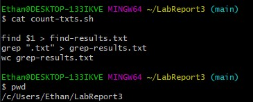

# Lab Report 5
---   

***Part 1 - Debugging Scenario***   
1. 
2. 
3.    
4. - File: LabReport3 | Directory: /c/Users/Student/LabReport3
   - DocSearchServer.java:
```
import java.io.File;
import java.io.IOException;
import java.net.URI;
import java.net.URISyntaxException;
import java.net.InetAddress;
import java.nio.file.Files;
import java.nio.file.Path;
import java.nio.file.Paths;
import java.util.ArrayList;
import java.util.List;
import java.util.Collections;

class FileHelpers {
    static List<File> getFiles(Path start) throws IOException {
        File f = start.toFile();
        List<File> result = new ArrayList<>();
        if(f.isDirectory()) {
            File[] paths = f.listFiles();
            for(File subFile: paths) {
                result.addAll(getFiles(subFile.toPath()));
            }
        }
        else {
            result.add(start.toFile());
        }
        return result;
    }
    static String readFile(File f) throws IOException {
        return new String(Files.readAllBytes(f.toPath()));
    }
}

class Handler implements URLHandler {
    Path base;
    Handler(String directory) throws IOException {
      this.base = Paths.get(directory);
    }
    public String handleRequest(URI url) throws IOException {
       List<File> paths = FileHelpers.getFiles(this.base);
       if (url.getPath().equals("/")) {
           return String.format("There are %d total files to search.", paths.size());
       } else if (url.getPath().equals("/search")) {
           String[] parameters = url.getQuery().split("=");
           if (parameters[0].equals("q")) {
               String result = "";
               List<String> foundPaths = new ArrayList<>();
               for(File f: paths) {
                   if(FileHelpers.readFile(f).contains(parameters[1])) {
                       foundPaths.add(f.toString());
                   }
               }
               Collections.sort(foundPaths);
               result = String.join("\n", foundPaths);
               return String.format("Found %d paths:\n%s", foundPaths.size(), result);
           }
           else {
               return "Couldn't find query parameter q";
           }
       }
       else {
           return "Don't know how to handle that path!";
       }
    }
}

class DocSearchServer {
    public static void main(String[] args) throws IOException {
        if(args.length == 0){
            System.out.println("Missing port number! Try any number between 1024 to 49151");
            return;
        }

        int port = Integer.parseInt(args[0]);

        Server.start(port, new Handler(args[1]));
    }
}
 ```   
   - Server.java:
```
import java.io.IOException;
import java.io.OutputStream;
import java.net.InetSocketAddress;
import java.net.InetAddress;
import java.net.URI;

import com.sun.net.httpserver.HttpExchange;
import com.sun.net.httpserver.HttpHandler;
import com.sun.net.httpserver.HttpServer;

interface URLHandler {
    String handleRequest(URI url) throws IOException;
}

class ServerHttpHandler implements HttpHandler {
    URLHandler handler;
    ServerHttpHandler(URLHandler handler) {
      this.handler = handler;
    }
    public void handle(final HttpExchange exchange) throws IOException {
        // form return body after being handled by program
        try {
            String ret = handler.handleRequest(exchange.getRequestURI());
            // form the return string and write it on the browser
            exchange.sendResponseHeaders(200, ret.getBytes().length);
            OutputStream os = exchange.getResponseBody();
            os.write(ret.getBytes());
            os.close();
        } catch(Exception e) {
            String response = e.toString();
            exchange.sendResponseHeaders(500, response.getBytes().length);
            OutputStream os = exchange.getResponseBody();
            os.write(response.getBytes());
            os.close();
        }
    }
}

public class Server {
    public static void start(int port, URLHandler handler) throws IOException {
        HttpServer server = HttpServer.create(new InetSocketAddress(port), 0);

        //create request entrypoint
        server.createContext("/", new ServerHttpHandler(handler));

        //start the server
        server.start();
        System.out.println("Server started at http://" + InetAddress.getLocalHost().getHostName() + ":" + port);
        System.out.println("(Or, if it's running locally on this computer, use http://localhost:" + port + " )");
    }
}

```
   - counts-txts.sh:
```
find $1 > find-results.txt
grep ".txt" > grep-results.txt
wc grep-results.txt

```
   > Command line trigger: ``` bash count-txts.sh```
   > The error was in the second line in the .sh file that the TA led the student to. In the second line, the student needed to grep for all txt files in find-results.txt   
***Part 2 - Reflection***   
> This class has been one, if not, the most useful class I've taken so far. I've learned something I will definitely be using post-graduation and it's both interesting and difficult. For the longest time, I struggled with figuring out the syntax for all the commands we learned but after constant use through labs, skill demos, and lectures. For example, the most recent skill demo where we had to make directories, traverse through them, and create files within those directories felt so "professional" for lack of better words-- it just felt like something I could see myself doing at a software engineering job. This quarter has been so fun, thank you so much!
