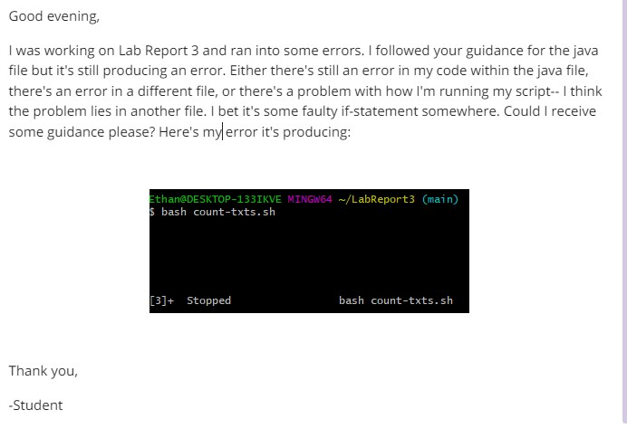
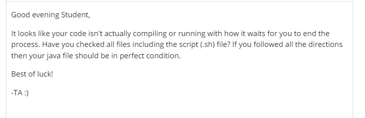

# Lab Report 5
---   

***Part 1 - Debugging Scenario***   
1. 
2. 
3. 
***Part 2 - Reflection***
> This class has been one, if not, the most useful class I've taken so far. I've learned something I will definitely be using post-graduation and it's both interesting and difficult. For the longest time, I struggled with figuring out the syntax for all the commands we learned but after constant use through labs, skill demos, and lectures. For example, the most recent skill demo where we had to make directories, traverse through them, and create files within those directories felt so "professional" for lack of better words-- it just felt like something I could see myself doing at a software engineering job. This quarter has been so fun, thank you so much!
